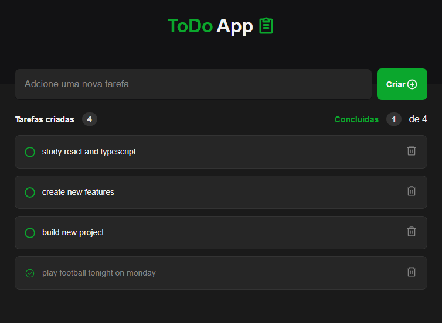

# ToDo App - Layout Project 

an aplication that allow users create, check tasks id just completed and is possible too delete tasks. 

Project developed during React and Typescript Lesson, and trainning react using the follows  basics react topics: 

* Components 
* Props 
*  States (useStates and useEffects)
* TypeScript 
* Basics Types 
* Css normal without libs 
* LOCALSTORAGE - to storage tasks

